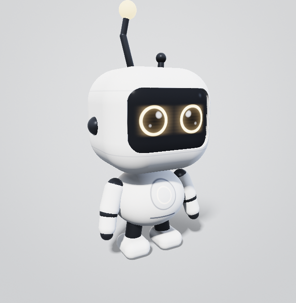

# Noki



**Noki** ist die visuelle Grundlage einer virtuellen Figur, die später als KI-Begleiter
auftreten soll. Dieses Repository enthält bislang **ausschließlich das Design** — Identität,
Formensprache, Material und Bewegungsgrundlage. Noch keine Agenten-Logik, keine KI-Anbindung,
keine Integration.

---

## Noki ansehen

**[`noki.html`](noki.html)** im Browser öffnen. Die Datei ist vollständig eigenständig — keine
Installation, kein Server, keine externen Abhängigkeiten.

Noki wird in Echtzeit als dreidimensionales Distanzfeld berechnet. Er lässt sich frei um alle
360° drehen:

| Eingabe | Wirkung |
|---|---|
| Ziehen mit Maus oder Finger | frei drehen |
| **Horizontal scrollen** | um die Hochachse drehen |
| **Vertikal scrollen** | neigen (bis ±80°) |
| Zwei-Finger-Pinch, Strg+Scroll | zoomen |
| Knopf „Bedienung“ unten | klappt die Leiste aus; beim Anfassen der Figur legt sie sich von selbst wieder weg |
| Ansichts-Schaltflächen | Vorne · Rechts · Hinten · Links · Oben · 3/4 |
| Reiter in der Leiste | Ansicht · Ereignis · Ausdruck · Ablauf · Gegenstand · Bewegung |
| Ereignis-Schaltflächen | die acht Ereignisse, die später die KI-Seite meldet |
| Ablauf-Schaltflächen | mehrstufige Sequenzen: Aufgabe, Wiedersehen, Erklären, Dankbarkeit … |
| Gegenstand-Schaltflächen | fünf Gegenstände, sieben Griffarten und die Nutzungsfolgen Trinken, Bedienen, Schrauben — jeder Griff mit eigener Fingerhaltung |
| Ausdrucks-Schaltflächen | neun Gefühlszustände und die Winkgeste |
| Gehen | startet und stoppt den Watschelgang. Mit dem Joystick läuft Noki dabei wirklich durch die Räume; ohne ihn (und mit `#welt=0`) bleibt es der Gang auf der Stelle, unter dem der Boden durchzieht |
| **Sitzen / Aufstehen** | eigene Taste im Reiter *Bewegung*: ein Klick startet den vollen Ablauf, während er läuft ist sie gesperrt. Ohne Klick setzt Noki sich nach 90 s von selbst — mit Zeitraffer ×10 nach neun Sekunden zu sehen. `#sitv=0…1` zeigt jeden Zwischenstand |
| **Hinlegen / Aufrichten** | dritte Taste im Reiter *Bewegung*: Noki legt sich in 2.2 s auf den Rücken — Hocke, Abrollen über den Rücken, Kinn zur Brust, Kopf setzt zuletzt auf. Sitzt er gerade, steht er erst vollständig auf. `#lieg=0…1` zeigt jeden Zwischenstand |
| **Einschlafen / Aufwachen** | vierte Taste im Reiter *Bewegung* — oder von selbst: liegt Noki etwa 20 s ruhig, wird er müde, die Lider sinken in drei Stufen, das Blinzeln wird gedehnt, und er schläft ein. Jede Eingabe weckt ihn wieder — mit Rückfall, Orientieren und einer kleinen Streckbewegung. Danach bleibt er **wach und liegend**. `#schlaf=0…1` zeigt jeden Zwischenstand |
| **Hüpfen** | fünfte Taste im Reiter *Bewegung*: ein kleiner Hopser aus dem Stand in 1.5 s — leicht in die Knie, abspringen, 0.45 s fliegen, landen, abfedern. Die einzige Bewegung, bei der er den Boden verlässt, und die einzige ohne Nachzustand: sie endet exakt in der Haltung, in der sie begann. `#huepf=0…1` zeigt jeden Zwischenstand |
| **Treppe in den Werkraum** | der Werkraum liegt 0.36 tiefer. Hinunter geht Noki mit dem normalen Gang, hinauf kommt er mit dem **Hüpfer** — die Stufen sind mit 0.045 nach seinem Bein bemessen, nicht nach dem Bauwesen |
| **Joystick unten links** | bewegt Noki durch die Räume — weiter außen heißt schneller. Für den Finger gebaut, funktioniert auf Handy und Tablet genauso wie mit der Maus. Solange die Bedienleiste offen ist, weicht er; beim Anfassen der Figur schließt sie sich von selbst |
| Zeitraffer ×10 | rafft die Zeitkaskade, damit Dösen und Schlaf in zwei Minuten sichtbar werden |

Noki steht dabei nie still: Er atmet, blinzelt in unregelmäßigem Rhythmus, sieht sich um, und
seine Stimmungsantenne schwingt jeder Kopfbewegung nach. Auch seine Hände ruhen nie ganz —
jeder Finger hat seine eigene Feder, und alle paar Sekunden legt sich einer neu an.

**Er verhält sich auch, wenn du nichts tust.** Nach 20 s lässt seine Aufmerksamkeit nach, nach
90 s setzt er sich hin und beschäftigt sich selbst, nach 4 Minuten döst er, nach 15 Minuten
schläft er — und der Glimm pulsiert dabei weiter. Sprichst du ihn an, dreht er dir den Kopf zu.
Lobst du ihn, hebt das seine Stimmung für Minuten, nicht für Sekunden.

Die Ereignis-Schaltflächen sind bewusst genau die Schnittstelle, die später ein KI-Agent
bedient: Sie melden **was passiert ist**, nicht **welche Animation laufen soll**. Was Noki
daraus macht, entscheidet er selbst.

---

## Dokumentation

**Wer Noki ist und wie er gebaut ist**

| Dokument | Inhalt |
|---|---|
| [01 · Charakter-Konzept](design/01-charakter-konzept.md) | Name, Herkunft, Persönlichkeit, Ausstrahlung, Wiedererkennbarkeit |
| [02 · Formensprache und Material](design/02-formensprache-material.md) | Der verbindliche Maßkanon: jedes Bauteil mit Position, Maß und Material |
| [03 · Rig und Animation](design/03-rig-und-animation.md) | Hierarchie, Drehpunkte, Grenzen, Bewegungsprinzipien, Gefühlssystem |

**Wie er sich bewegt und verhält**

| Dokument | Inhalt |
|---|---|
| [04 · Bewegungssprache](design/04-bewegungssprache.md) | Die sieben Leitsätze des Animationsstils, das geschichtete Ruheverhalten, Stehen, Gehen und Sitzen |
| [05 · Gesicht und Emotionen](design/05-gesicht-und-emotionen.md) | Sieben Gefühle mit Augen, Mund, Kopf, Körpersprache und Glimm |
| [06 · Interaktion und Verhalten](design/06-interaktion-und-verhalten.md) | Die fünf Interaktionsfälle, das Verhaltensmodell und die Schnittstelle zur späteren KI-Seite |
| [07 · Animationsliste](design/07-animationsliste.md) | 38 Animationen mit Auslöser, Gefühl und Spezifikation |
| [09 · Stufe 2 und Greifsystem](design/09-stufe2-und-greifsystem.md) | Die dreizehn Animationen der Stufe 2 und das Sequenzsystem |
| [10 · Das universelle Greifsystem](design/10-greifsystem.md) | Handgelenk, sieben Griffarten, Tasse, Smartphone und Schraubenzieher in voller Tiefe |
| [11 · Die Umgebung](design/11-umgebung.md) | Grundriss, Wände, Durchgänge, Kollision — und warum die Räume nach Nokis Schrittlänge bemessen sind |
| [08 · Anhang](design/08-anhang-referenzvideo.md) | Analyseraster, falls später ein Referenzvideo einfließen soll |

Die Maße in [02](design/02-formensprache-material.md) stimmen exakt mit `noki.html` überein.
Das Distanzfeld im Viewer ist nicht die Illustration der Dokumentation — es *ist* das Modell.

---

## Ansichten reproduzieren

Jede Kameraeinstellung lässt sich über die Adresse festlegen, etwa für Standbilder:

```
noki.html#yaw=90&pitch=20&dist=2.0&e=denkend&still=1&t=0&ui=0
```

`yaw`/`pitch` in Grad, `dist` Kameraabstand, `e` Ausdruckszustand, `still=1` friert jede
Bewegung ein, `ui=0` blendet die Bedienoberfläche aus, `theme` erzwingt `dark` oder `light`.
Dazu `pose=` (stehen · sitzen · doesen · schlaf), `clip=` mit `cu=` für eine Einlage an einem
bestimmten Zeitpunkt, `achtung=1` für die Zuhör-Haltung, `geh=` für eine Schrittphase
(`0 … 1` = ein voller Schritt), `sitv=`/`sitri=` für jeden Zwischenstand des Hinsetzens und
`lieg=`/`liegri=` für jeden Zwischenstand des Hinlegens, `schlaf=`/`schlri=` für jeden
Zwischenstand des Einschlafens und Aufwachens und `huepf=` für jeden Zwischenstand des
Hüpfers — dieser ohne Richtungsangabe, denn der Hopser hat nur einen Weg.
Dazu `pos=x,z,kurs` für Nokis Standort in der Wohnung und `welt=0` für die alte leere Bühne.

**Selbsttest:** `noki.html#selftest=1` fährt das Rig über 1200 simulierte Sekunden und prüft
alle 16 Kanäle gegen ihre Grenzen, die Reihenfolge der Zeitkaskade, die Anti-Wiederholung der
Idle-Einlagen, die Sprungfreiheit jedes Kanals, den Verlauf der Stimmung, die konstante
Beinlänge über den Sitzübergang und die innere Stimmigkeit des Gangmusters.

> **Hinweis zum Gang:** Bis zur Wohnungsstufe rückte Noki um genau den Weg vor, den sein
> abstoßender Fuß zurückgelegt hatte — er rutschte also nicht. Mit `WELT_GANG = 3` ist das
> bewusst aufgegeben: sein Bein misst 8,3 % seiner Körperhöhe, Menschentempo bräuchte sonst
> 12 Schritte je Sekunde. Er rutscht jetzt sichtbar. Der Faktor steht im Selbsttest-Bericht.

Dazu die **Liegeprüfung**: Über den gesamten Hinlege-Ablauf, in beiden Richtungen, wird
nachgerechnet, dass kein Punkt von Rumpf, Hals, Kopf, Armen und Händen unter den Boden gerät,
dass die Figur in der Endlage weder schwebt noch einsinkt, dass der Kontaktpunkt monoton vom
Gesäß zum Kopf wandert — und dass bei `liegeU = 0` jeder neue Betrag exakt null ist, Stehen,
Gehen und Sitzen also unverändert geblieben sind.

Und die **Ablaufprüfung**: Die vier Abläufe *Stehen → Hinlegen → Schlafen*, *Schlafen →
Aufwachen*, *Aufwachen → liegen bleiben* und *aus dem Schlaf heraus Aufstehen* werden als
echte Läufe durch das Rig gefahren und Bild für Bild geprüft — Bodenkontakt, Fußsohle,
Gelenkwinkel, Augenöffnung und Sprungfreiheit jedes Kanals. Dazu die Zusicherungen, die
diese Stufe ausmachen: dass der Schlaf erst bei vollständigem Liegen beginnt, dass beim
Aufwachen der **Rückfall** der Augenlider wirklich stattfindet, und dass Noki nach dem
Aufwachen **nicht von selbst aufsteht**.

Dazu die **Hüpfprüfung**: Der Hopser ist die einzige Bewegung, bei der Noki den Boden
verlässt — und genau das macht ihn prüfbar. Nachgerechnet wird, dass der Auftrieb außerhalb
der Flugphase **bitgleich null** ist (die Füße können vor dem Absprung und nach der Landung
gar nicht schweben), dass die Fußsohle in jedem Bild genau um den Auftrieb über dem Boden
liegt, dass die Beine im Flug gestreckt bleiben, dass die Hocke den Rumpf senkt statt ihn zu
heben — und dass am Ende jeder Betrag wieder exakt null ist, die Standhaltung nach dem
Hopser also bitgleich die von vorher ist.

Dazu die **Raumprüfung**: Die Umgebung wird gefahren, nicht betrachtet — derselbe Weg, den ein
Nutzer mit dem Joystick nimmt, läuft Bild für Bild durch das Rig. Geprüft wird, dass Noki im
Hauptbereich startet, den Weg durch beide Durchgänge und zurück findet, dass **kein einziges
Bild** in einer Wand liegt, dass er aus jeder Raummitte in acht Richtungen gegen Wände und Ecken
fahren kann, ohne hindurchzukommen oder sich festzufahren, und dass jeder Durchgang breit genug
ist, dass man nicht zielen muss. Dazu die Nullprobe: mit `welt=0` bewegt sich nichts.

Dazu die **Griffprüfung**: Für jeden der fünf Gegenstände wird nachgerechnet, ob jeder
tragende Finger die Grifffläche wirklich berührt, ob die nicht tragenden Finger wegbleiben,
ob der Daumen dem Griff **gegenüber** liegt statt nur daneben, ob ein Fingerende durch die
Handfläche läuft, und ob der Gegenstand in Ballen, Unterarm, Rumpf oder Kopf eindringt —
letzteres in **jeder** Greifphase. Geprüft wird außerdem, dass der Daumen an **beiden**
Händen auf der Außenseite sitzt: Genau dieser Fehler steckte einmal im Modell, sauber
symmetrisch auf beiden Seiten. Anschließend laufen alle Gegenstände durch alle Phasen, damit ein Aufschwingen
der Fingerfedern auffällt, bevor man es sieht. Dieselbe Rechnung hat die Griffwerte
ursprünglich bestimmt; sie wacht seither über sie.

---

## Stand

- [x] Charakter-Identität
- [x] Formensprache, Maßkanon, Materialien
- [x] Frei drehbares 3D-Modell, aus allen Winkeln geprüft
- [x] Rig, Gefühlssystem, Idle-Animation
- [x] Animations- und Verhaltenskonzept
- [x] **Stufe 1 umgesetzt** — 13 Animationen inkl. Gehen, Verhaltensmodell, Zeitkaskade, Stimmung
- [x] **Stufe 2 umgesetzt** — Sequenzsystem, zehn neue Einlagen, zwei Ausdrücke, neun Abläufe, Greifsystem mit vier Gegenständen
- [x] **Greifsystem** — Handgelenk, sieben Griffarten, Gewichtswirkung, drei volle Nutzungsfolgen
- [x] **Hände mit Fingern** — vier Finger und ein Daumen je Hand, jeder mit eigener Feder;
      gerechnete Griffwerte statt geschätzter, Griffprüfung im Selbsttest
- [x] **Handanatomie korrigiert** — Daumen außen statt innen, drei Fingergelenke,
      Handwurzel, Pronation der leeren Hand
- [x] **Sitzen und Aufstehen** — Kniegelenk, gerechnete Sitzhaltung, eigener
      Bewegungsablauf mit Vorbereitung, Absenken, Aufsetzen und Aufrichten
- [x] **Hinlegen und Liegen** — abgeleitete Bodenhöhe statt Keyframes: der Rumpf rollt
      über den Rücken ab, der Kontaktpunkt wandert von selbst vom Gesäß zum Kopf,
      die Hände gleiten am Boden entlang
- [x] **Einschlafen, Schlafen und Aufwachen** — dritte Zeitachse, an das Liegen
      strukturell gekoppelt; Lider in drei Stufen, gedehntes Blinzeln, deterministischer
      Schlaf-Leerlauf, Aufwachen mit Rückfall, Orientieren und Strecken
- [x] **Hüpfen** — der erste Vorgang ohne Nachzustand: eigene Zeitachse, aber nur ein Weg
      und kein Rückwärts-Kurvensatz. Der Auftrieb geht auf Rumpf *und* Beinwurzel, damit die
      Figur als Ganzes steigt; außerhalb der Flugphase ist er bitgleich null
- [x] **Umgebung** — fünf Räume auf zwei Ebenen, fünf Durchgänge, Boden und Wände als Distanzfeld neben der
      Figur statt in ihr; Weltposition und Kurs, Kollision mit Gleiten, virtueller Joystick.
      Die Räume sind nach Nokis Schrittlänge bemessen — sein Bein misst 8.3 % seiner Höhe
- [ ] Stufe 3: die seltenen Momente, dreizehn weitere Gegenstände, Gegenstände mit Platz in der Welt
- [ ] Anbindung als interaktiver Begleiter

[07 · Animationsliste](design/07-animationsliste.md) markiert mit ▶, was bereits läuft, und
schlägt die Produktionsreihenfolge in drei Stufen vor.
