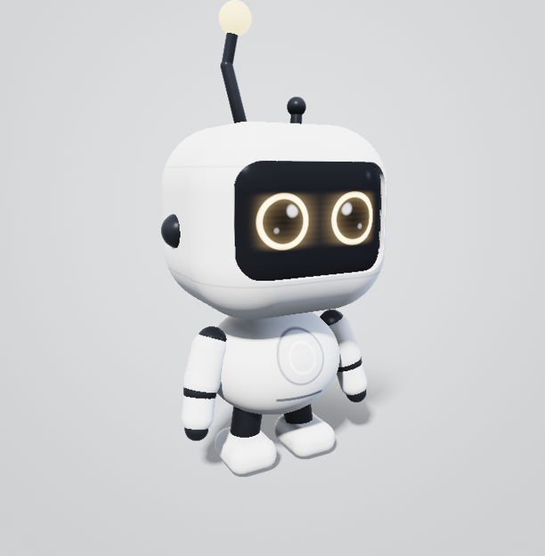

# Noki



**Noki** ist eine eigenständige Desktop-Figur für macOS: ein kleiner Roboter, der auf dem
Schreibtisch lebt — läuft, fliegt, auf Fenster reagiert und einfache Desktop-Aktionen ausführt.

## Aktueller Stand

Desktop Character / macOS Assistant als Tauri-2-App (Menüleisten-App ohne Dock-Symbol).
Die Figur wird in Echtzeit per WebGL (Distanzfeld-Raymarching) gerendert.

## Hauptfunktionen

- WALK / FLY / HOVER / SPEED, Plasma und Schwingen
- Folgt beim Wechsel der macOS-Spaces sichtbar; Vollbild-Unterstützung (Noki zeigen/verbergen)
- Maus folgen, Energie-Stufen, stufenloser Größenregler 0.45×–2.5×
- Freeze, Kamera (Screenshot, Bildschirmaufnahme), Nokis Büro
- Globale Shortcuts: Ctrl+1 Screenshot · Ctrl+2 Aufnahme · Ctrl+3 Freeze · Ctrl+4 Nokis Büro
- Vorder-/Hintergrund, Tiefe hinter Fenstern (eigene Maskierung)
- Interaktionen und Emotionen (Streicheln, Winken, Kopfstoß, Schlaf …)

## Architektur

| Teil | Ort | Aufgabe |
|---|---|---|
| Frontend / Rendering | `desktop/index.html` | Figur, Animation, Verhalten, Physik (eine Datei, WebGL) |
| Tauri-App | `desktop/src-tauri/` | Fenster, Menüleiste, Events zwischen Rust und Frontend |
| Rust / macOS nativ | `desktop/src-tauri/src/lib.rs` | Spaces (CGS/SkyLight), Fensterliste, Aufnahme, Shortcuts (Carbon), Menü-Regler |

## Build / Start

Voraussetzung: Rust (cargo) auf macOS. Die Tauri-CLI wird nicht benötigt.

```sh
cd desktop
./bauen.sh              # Debug-Paket  -> desktop/Noki.app
./bauen.sh --release    # Release-Paket
open Noki.app
```

Prüfen: `cd desktop/src-tauri && cargo check`.
Eingebauter Selbsttest: `desktop/index.html#selftest=1` im Browser öffnen.

Hinweis: Das produktive Frontend ist `desktop/index.html`; die Tauri-Main-Window-URL ist
explizit auf diese Datei gesetzt. `noki.html` und `legacy/noki-reference.html` sind
nicht Teil des Desktop-Entrypoints.

## Projektstruktur

```text
desktop/            macOS-App (Frontend + Tauri/Rust), bauen.sh
design/             Charakter-, Bewegungs- und Interaktionskonzept, Renders
noki.html           eigenständige 3D-Referenzansicht der Figur (Browser)
legacy/             ältere Referenzfassung
```
